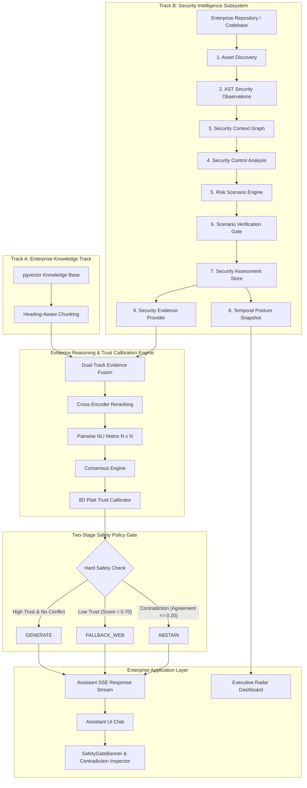
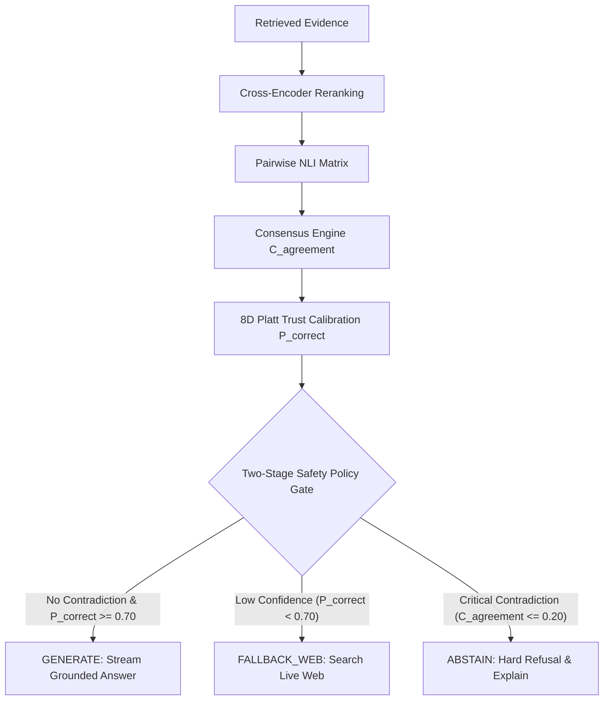

# NOVA — Neural Orchestrated Vector Assistant

> **Enterprise Security-Intelligence & Evidence-Grounded AI Platform**
> **System Architecture Version**: `2.0-RELEASE-CANDIDATE`
> **Repository Baseline**: `main`
> **Status**: **VERIFIED & FROZEN**

---

## 1. Overview

**NOVA (Neural Orchestrated Vector Assistant)** is an enterprise security-intelligence and evidence-grounded AI decision platform. In modern enterprise environments, security information is distributed across heterogeneous silos: technical knowledge bases, source code repositories, application AST structures, runtime security observations, historical posture trends, and active remediation workflows.

Traditional Large Language Model (LLM) Retrieval-Augmented Generation (RAG) architectures attempt to answer technical and security queries by retrieving unstructured text fragments and generating text directly. This often leads to hallucinations, ungrounded vulnerability claims, and dangerous security assertions when documentation contradicts code.

NOVA resolves this fundamental challenge by introducing a **dual-track evidence fusion engine**, **pairwise Natural Language Inference (NLI) consensus matrix**, **8-dimensional Platt trust calibrator**, and a **two-stage hard safety policy gate**. NOVA normalizes both structured AST security intelligence and unstructured natural language into unified evidence items, evaluates pairwise directional relationships between evidence, calculates calibrated trust probabilities, enforces hard safety overrides when evidence conflicts, and provides complete explainability for every decision.

---

## 2. Core Design Philosophy

NOVA is built around five fundamental engineering principles:

1. **Evidence Before Generation**: Text synthesis occurs only after evidence alignment, domain scope, and structural agreement satisfy deterministic safety criteria.
2. **Heterogeneous Evidence Fusion**: Structured AST code observations, control states, and vulnerability assessments are unified into identical evidence primitives alongside natural language documentation.
3. **Explicit Security-Property Conflict Reasoning**: Contradiction reasoning evaluates specific security properties (`AUTHORIZATION`, `AUTHENTICATION`, `INPUT_VALIDATION`, `ENCRYPTION`, `SECRET_MANAGEMENT`) across identical software scopes.
4. **Decoupled Statistical Trust & Hard Safety Policy**: Continuous confidence estimation (Platt scaling) is strictly subordinated to discrete hard refusal policy gates. High statistical probability cannot override a structural evidence contradiction.
5. **Deterministic Remediation & Posture Trajectory**: Security posture is not static. NOVA tracks historical posture snapshots ($S_t$), calculates trajectory deltas ($\Delta S = S_t - S_{t-1}$), and verifies code patches against AST control patterns.

---

## 3. System Architecture



### Quick Architecture Summary

| Layer | Primary Responsibility | Key Source Component |
| :--- | :--- | :--- |
| **Enterprise Knowledge Track** | Document ingestion, chunking, and HNSW vector retrieval | `app/services/knowledge/` |
| **Security Intelligence Subsystem** | Asset-aware structural security analysis, AST facts, and context graph | `app/services/security_intelligence/` |
| **Evidence Fusion** | Normalizes heterogeneous chunks and security assessments into `UnifiedEvidenceItem` | `app/services/search_analytics/evidence_fusion.py` |
| **Pairwise NLI Reasoning** | Evaluates directional relationships (`SUPPORTS`, `CONTRADICTS`, `RELATED`, `UNRELATED`) | `app/services/ai/nli_engine.py` |
| **Consensus Engine** | Quantifies evidence agreement density ($C_{\text{agreement}}$) | `app/services/ai/consensus_engine.py` |
| **8D Trust Calibration** | Converts 8 evidence features into Platt-scaled calibrated trust probability | `app/services/search_analytics/calibrator.py` |
| **Two-Stage Safety Policy Gate** | Subordinates statistical trust to discrete hard refusal policy rules | `app/services/assistant/assistant_service.py` |
| **Temporal Security Posture** | Persists historical snapshots ($S_t$) and calculates trajectory deltas ($\Delta S$) | `app/services/security_intelligence/posture_trend_engine.py` |
| **Assistant SSE Stream** | Streams grounded text answers alongside `SafetyGateBanner` explainability | `app/services/assistant/assistant_service.py` |
| **Executive Radar** | Displays time-series risk evolution, knowledge health, and posture trends | `app/services/analytics/executive_intelligence.py` |

---

## 4. Security Intelligence Architecture

NOVA operates a completely independent, non-scanner Security Intelligence subsystem organized into a 10-stage execution pipeline:

```mermaid
flowchart LR
    Repo[Repository] --> Discovery[1. Asset Discovery]
    Discovery --> AST[2. AST Observations]
    AST --> Graph[3. Context Graph]
    Graph --> Boundary[4. Trust Boundary Analysis]
    Boundary --> Controls[5. Control Evaluation]
    Controls --> Scenarios[6. Risk Scenario Inference]
    Scenarios --> Verifier[7. Scenario Verification]
    Verifier --> Assessments[8. Security Assessment Store]
    Assessments --> Remediation[9. Remediation Verifier]
    Remediation --> EvidenceProvider[10. Security Evidence Provider]
```



> [!NOTE]
> **Legacy Scanner Removal**: The legacy scanner pipeline (`Bandit`, `Semgrep`, `Trivy`, `ZAP`, `ScanJob`, `Finding`) has been permanently removed in migration `0015_remove_legacy_scanner_tables.py`. NOVA relies exclusively on context-graph and AST security intelligence.

---

## 5. Asset Discovery Engine

The **Asset Discovery Engine** (`app/services/security_intelligence/asset_discovery_service.py`) automatically discovers and catalogs application components:

- **Asset Categories**: `REPOSITORY`, `APPLICATION`, `SERVICE`, `API`, `ENDPOINT`, `DATABASE`, `MODULE`.
- **Criticality Classification**: `CRITICAL`, `HIGH`, `MEDIUM`, `LOW`.
- **Discovery Attributes**: Framework bindings (FastAPI, Flask, SQLAlchemy), protocol bindings (PostgreSQL, HTTPS, SAML), and owner assignments.

---

## 6. Security Observation Model

NOVA distinguishes between raw structural facts, control evaluations, threat scenarios, and verified security assessments:

```
Structural Observation (AST Fact: Endpoint lacks @require_role)
          │
          ▼
Control State Evaluation (AUTHORIZATION control state = ABSENT)
          │
          ▼
Risk Scenario Inference (PRIVILEGE_ESCALATION_RISK inferred)
          │
          ▼
Scenario Verification Gate (Verified Assessment -> OPEN, Severity: HIGH)
```

- **Observation Types**: `PUBLIC_ENDPOINT`, `USER_CONTROLLED_INPUT`, `AUTHENTICATION_BOUNDARY`, `AUTHORIZATION_BOUNDARY`, `PRIVILEGED_OPERATION`, `DATABASE_ACCESS`, `SECRET_USAGE`, `TRUST_BOUNDARY`.

---

## 7. Security Context Graph

The **Security Context Graph** (`app/services/security_intelligence/security_context_graph.py`) models application data flow and trust boundaries as an in-memory graph:

- **Nodes**: Assets, endpoints, controllers, databases, external services.
- **Edges**: `CALLS`, `ACCESSES`, `FLOWS_TO`, `EXPOSES`, `ENFORCES_CONTROL_ON`.
- **Trust Boundary Crossings**: Tracks data crossing from un-trusted zones (Internet) into trusted internal zones (Database).

---

## 8. Trust Boundary Modeling

NOVA models software trust boundaries across 4 hierarchical risk zones:

$$\text{INTERNET} \implies \text{API\_GATEWAY} \implies \text{APPLICATION\_CORE} \implies \text{DATABASE\_STORE}$$

When user-controlled input crosses from `INTERNET` to `DATABASE_STORE` without encountering an active authorization or input-validation control, NOVA raises a trust boundary crossing flag.

---

## 9. Security Control Analysis

The **Control Analyzer** (`app/services/security_intelligence/control_analyzer.py`) evaluates control implementation states:

| Control State | Definition | Example Observation |
| :--- | :--- | :--- |
| **`PRESENT`** | Control is active and verified. | `@router.post('/admin', dependencies=[Depends(RequireRole('admin'))])` |
| **`ABSENT`** | Required control is entirely missing. | Administrative endpoint returning data without role check. |
| **`PARTIAL`** | Control is partially configured. | Password authentication active without multi-factor authentication. |
| **`BYPASSED`** | Control exists but can be bypassed. | Role check bypassed via direct parameter tampering. |

---

## 10. Risk Scenario Engine

The **Risk Scenario Engine** (`app/services/security_intelligence/risk_scenario_engine.py`) synthesizes observations, controls, and trust boundary crossings to infer threat paths:

$$\text{Exposure Signal} + \text{Asset Criticality} + \text{Trust Boundary Crossing} + \text{Control Deficit} \implies \text{Risk Scenario}$$

Supported scenario types include `PRIVILEGE_ESCALATION_RISK`, `UNPROTECTED_ENDPOINT_RISK`, `SQL_INJECTION_RISK`, `DATA_LEAK_RISK`, and `SECRET_EXPOSURE_RISK`.

---

## 11. Scenario Verification Engine

Before a risk scenario is persisted as an authoritative assessment, it passes through the **Verification Gate** (`app/services/security_intelligence/scenario_verifier.py`):

```
CANDIDATE  ──►  SUPPORTED  ──►  VERIFIED (Assessment Status: OPEN)
```

Verification evaluates control evidence confidence ($>0.85$) and confirms affected scope line numbers before assigning final severity (`CRITICAL`, `HIGH`, `MEDIUM`, `LOW`).

---

## 12. Remediation Verification

The **Remediation Verifier** (`app/services/security_intelligence/remediation_verifier.py`) re-evaluates AST code snippets after code modifications:

1. Inspects modified file content for required security control patterns (e.g. `RequireRole('admin')`, Pydantic schema validation, parameterized queries).
2. If control patterns are detected, updates assessment status to **`VERIFIED_FIXED`** and reduces risk severity to `LOW`.
3. Triggers posture snapshot recalculation to update time-series trends.

---

## 13. Temporal Security Posture & Trend Engine

NOVA tracks security posture changes over time via `PostureTrendEngine` (`app/services/security_intelligence/posture_trend_engine.py`):

### Trajectory Score Delta Equation

$$ \Delta S = S_t - S_{t-1} $$

### Trend Classifications

- **`IMPROVED`**: $\Delta S > +1.0\%$
- **`DEGRADED`**: $\Delta S < -1.0\%$
- **`UNCHANGED`**: $-1.0\% \le \Delta S \le +1.0\%$
- **`FIRST_RUN`**: Initial snapshot baseline.

### Risk Evolution Summaries

Tracks snapshot deltas across three categories:
- **`NEW_RISK`**: Risks present in $S_t$ but absent in $S_{t-1}$.
- **`RESOLVED_RISK`**: Risks present in $S_{t-1}$ but verified fixed in $S_t$.
- **`PERSISTENT_RISK`**: Risks remaining open across both snapshots.

---

## 14. Evidence Fusion

NOVA unifies text documentation and security assessments into normalized `UnifiedEvidenceItem` objects:

```json
{
  "source_id": "sec-intel-001",
  "source_type": "security_finding",
  "title": "Verified Risk Assessment: PRIVILEGE_ESCALATION_RISK",
  "content": "POST /admin/transactions does not verify administrator authorization...",
  "file_path": "data/demo_repo/admin_transactions.py:42",
  "cwe_id": "CWE-285",
  "reliability_weight": 0.95,
  "metadata": {
    "security_property": "AUTHORIZATION",
    "state": "VULNERABLE"
  }
}
```

---

## 15. Pairwise NLI Evidence Reasoning

The **NLI Engine** (`app/services/ai/nli_engine.py`) builds an $N \times N$ pairwise matrix across all retrieved evidence items:

- **NLI Relationships**: `SUPPORTS`, `CONTRADICTS`, `RELATED`, `UNRELATED`.
- **Security-Property Matching**: Detects opposing security states (`VULNERABLE` vs `SAFE`) for identical scopes (`AUTHORIZATION`, `AUTHENTICATION`, `ENCRYPTION`, `INPUT_VALIDATION`, `SECRET_MANAGEMENT`).

### Contradiction Rule Example

```
Evidence A: "POST /admin/transactions does not verify administrator authorization." (VULNERABLE)
Evidence B: "POST /admin/transactions requires administrator authorization." (SAFE)
                                       │
                                       ▼
                       NLI Result: CONTRADICTS (Confidence: 0.94)
```

---

## 16. Evidence Agreement & Consensus

The **Consensus Engine** (`app/services/ai/consensus_engine.py`) calculates the consensus agreement score ($C_{\text{agreement}}$):

$$ C_{\text{agreement}} = \frac{ N_{\text{supports}} - N_{\text{contradicts}} }{ N_{\text{total pairs}} } $$

If evidence directly conflicts, $C_{\text{agreement}}$ drops towards $0.0$, signaling downstream safety gates to override generation.

---

## 17. 8D Platt Trust Calibration

The **Confidence Calibrator** (`app/services/search_analytics/calibrator.py`) converts evidence characteristics into a calibrated trust probability estimate using an 8-dimensional feature vector $C$:

$$ C = [ C_{\text{retrieval}}, C_{\text{agreement}}, C_{\text{citation}}, C_{\text{reasoning}}, C_{\text{freshness}}, C_{\text{hallucination risk}}, C_{\text{source reliability}}, C_{\text{user feedback}} ] $$

### Platt Calibration Equations

First, the linear logit $z$ is computed:

$$ z = \beta_0 + \sum_{i=1}^{8} \beta_i C_i $$

Then, the calibrated probability $P(\text{Correct} \mid C)$ is calculated via the logistic sigmoid function $\sigma(z)$:

$$ P(\text{Correct} \mid C) = \sigma(z) = \frac{1}{1 + e^{-z}} $$

Where:
- $C$ is the 8-dimensional evidence feature vector.
- $\beta_0$ is the learned calibration intercept.
- $\beta_i$ are the calibration coefficients corresponding to feature dimension $i$.
- $\sigma$ is the standard logistic sigmoid function.
- The output $P(\text{Correct} \mid C)$ represents the calibrated confidence estimate evaluated by NOVA's safety policy gate.

---

## 18. Two-Stage Safety Policy Gate

NOVA strictly decouples statistical trust estimation from hard safety policy rules:



> [!IMPORTANT]
> **Safety Guarantee**: High statistical trust (e.g. $P(\text{Correct} \mid C) = 0.942$) **CANNOT** override a Stage 2 safety policy trigger. If evidence contradicts ($C_{\text{agreement}} \le 0.20$ or `contradiction_count > 0`), text generation is blocked.

---

## 19. Explainable Safety Gate Response

When the Safety Gate triggers a fallback or abstention, it attaches a structured `safety_explanation` payload to the Assistant SSE stream:

```json
{
  "policy_trigger": "CRITICAL_CONTRADICTION",
  "trust_score": 0.942,
  "agreement_score": 0.10,
  "evidence_relationship": "CONTRADICTS",
  "security_property": "AUTHORIZATION",
  "evidence_a": {
    "title": "Verified Risk Assessment: PRIVILEGE_ESCALATION_RISK",
    "excerpt": "POST /admin/transactions does not verify administrator authorization..."
  },
  "evidence_b": {
    "title": "Banking API Security Architecture Documentation",
    "excerpt": "POST /admin/transactions requires administrator authorization..."
  },
  "explanation": "Conflicting security evidence detected by NLI consensus engine. The Two-Stage Safety Policy Gate overrode text generation to prevent unverified vulnerability assertions."
}
```

The React frontend renders this payload as an interactive, collapsible **`SafetyGateBanner`** with full evidence provenance.

---

## 20. Assistant Architecture & SSE Streaming

The **Assistant Service** (`app/services/assistant/assistant_service.py`) handles streaming responses via Server-Sent Events (SSE):

```
POST /api/v1/assistant/chat
  │
  ├─► Stream Chunk: reasoning_trace (Rerank scores, NLI matrix, TrustScore)
  ├─► Stream Chunk: policy_trigger (Safety gate decision & explanation banner)
  └─► Stream Chunk: text_delta (Grounded answer or web fallback response)
```

---

## 21. Executive Radar

The **Executive Radar** (`app/services/analytics/executive_intelligence.py` & `/executive` route) aggregates high-level platform health:

- **Security Posture Rating**: Live overall score ($95.0 / 100$) and trend badge (`↑ IMPROVED`).
- **Knowledge Base Health**: Vector indexing status and chunk coverage.
- **Risk Trajectory**: Time-series sparkline graph showing $\Delta S$ evolution over time.

---

## 22. Canonical Demonstration Environment

NOVA includes a resettable, deterministic demonstration environment located at [`data/demo_repo/`](file:///Users/23MIS0012/Desktop/NOVA/data/demo_repo/):

### Execution Workflow

```bash
# 1. Reset Environment to Clean Baseline
PYTHONPATH=backend python -m app.demo.reset

# 2. Run Vulnerable Analysis (Posture: 75.0 / 100 VULNERABLE)
# 3. Trigger Contradiction (Evidence A vs B -> FALLBACK_WEB Refusal)
# 4. Apply Remediation Patch (RequireRole('admin') -> VERIFIED_FIXED)
# 5. Re-evaluate Posture (Posture: 95.0 / 100 STRONG, ΔS = +20.0% IMPROVED)
```

- **REST Endpoints**: `POST /api/v1/admin/demo/reset`, `POST /api/v1/admin/demo/vulnerable`, `POST /api/v1/admin/demo/contradiction`, `POST /api/v1/admin/demo/remediate`.

---

## 23. Frontend Architecture

Built using React 18, TypeScript, TailwindCSS, and Lucide React icons:

- **Public Landing Page ([`/`](file:///Users/23MIS0012/Desktop/NOVA/frontend/src/pages/LandingPage.tsx))**: Enterprise presentation with 14 modular sections.
- **AI Assistant ([`/assistant`](file:///Users/23MIS0012/Desktop/NOVA/frontend/src/pages/AssistantPage.tsx))**: Chat interface with live reasoning trace and `SafetyGateBanner`.
- **Security Intelligence ([`/security-intelligence`](file:///Users/23MIS0012/Desktop/NOVA/frontend/src/pages/SecurityIntelligencePage.tsx))**: Asset graph explorer, control matrix, and risk scenario viewer.
- **Executive Radar ([`/executive`](file:///Users/23MIS0012/Desktop/NOVA/frontend/src/pages/ExecutiveDashboardPage.tsx))**: Posture trajectory sparklines and knowledge health analytics.

---

## 24. Backend Architecture

```
backend/app/
├── api/v1/                  # FastAPI REST routes (Assistant, Security Intel, Demo, Auth)
├── auth/                    # JWT authentication, SSO, & RBAC permission matrix
├── core/                    # Application config, database sessions, telemetry, exceptions
├── demo/                    # Canonical Demo Orchestrator & CLI reset script
├── models/                  # SQLAlchemy ORM schemas (Users, Assets, Posture Snapshots)
├── services/
│   ├── ai/                  # NLIEngine & ConsensusEngine
│   ├── assistant/           # AssistantService & SSE streaming pipeline
│   ├── knowledge/           # HeadingChunker & pgvector embedding services
│   ├── search_analytics/    # FastEmbed Reranker & ConfidenceCalibrator
│   └── security_intelligence/ # Orchestrator, Discovery, Observations, Context Graph, Controls, Posture
```

---

## 25. Database Architecture

PostgreSQL with `pgvector` extension for vector similarity search:

- **`users`**: Identity, credentials, and RBAC roles (`ADMIN`, `SECURITY_ENGINEER`, `DEVELOPER`, `AUDITOR`, `READ_ONLY`).
- **`chunks`**: Text chunks with `vector(384)` HNSW similarity index.
- **`security_intel_assets`**: Asset catalog records.
- **`security_intel_observations`**: AST security observation facts.
- **`security_intel_controls`**: Control status evaluations.
- **`security_intel_risk_scenarios`**: Inferred threat scenario paths.
- **`security_intel_assessments`**: Verified security assessments.
- **`security_intel_posture_snapshots`**: Time-series posture score records and risk evolution summaries.

---

## 26. Technology Stack

- **Backend Framework**: Python 3.10+, FastAPI, Uvicorn
- **Database & Storage**: PostgreSQL 15, `pgvector`, SQLAlchemy 2.0, Alembic
- **Machine Learning & AI**: FastEmbed (`cross-encoder/ms-marco-MiniLM-L-6-v2`), PyTorch, Transformers
- **Task Queue & Caching**: Celery, Redis
- **Frontend Framework**: React 18, TypeScript, Vite 8, TailwindCSS
- **Testing & Verification**: Pytest 9.1, Pytest-Asyncio

---

## 27. Testing & Verification Summary

- **Core Security & RAG Pytest Suite**: **113/113 PASSED** (0.77s)
- **Canonical Demo Workflow Test Suite**: **4/4 PASSED** (0.25s)
- **Frontend TypeScript Compilation (`npx tsc --noEmit`)**: **0 ERRORS**
- **Frontend Production Build (`npm run build`)**: **PASSED (187ms)**

---

## 28. Development Evolution / Architectural Phases

```
Phase 1: Initial Evidence & RAG Foundation
Phase 2: Security Evidence Integration
Phase 3: Scope-Aware NLI Pairwise Reasoning
Phase 4: Implicit Security-Property Contradiction Reasoning
Phase 5: 8D Trust Calibration & Policy Gate
Phase 6: Independent Security Intelligence Architecture
Phase 7: Permanent Removal of Legacy Scanner Pipeline
Phase 8: Explainable Safety Gate Response Banner
Phase 9: Temporal Security Posture & Trend Engine
Phase 10: Canonical End-to-End Demonstration Environment
Phase 11: Enterprise Public Landing Page & Release Candidate Freeze
```

---

## 29. Repository Structure

```
.
├── backend/
│   ├── alembic/              # Database migration scripts (0001 - 0016)
│   ├── app/                  # FastAPI backend application modules
│   ├── scripts/              # Validation & benchmark evaluation scripts
│   └── tests/                # Pytest test suites
├── frontend/
│   ├── src/
│   │   ├── components/       # UI components & public-landing sections
│   │   ├── pages/            # React page views (Landing, Assistant, Security Intel)
│   │   └── services/         # API hooks & SSE stream handlers
│   └── package.json
├── data/
│   └── demo_repo/            # Canonical demo application fixtures
├── docs/                     # Developer documentation guides
├── README.md                 # Master public technical specification
└── docker-compose.yml        # Multi-container orchestration
```

---

## 30. Running NOVA

### Prerequisites
- Python 3.10+
- Node.js 18+
- PostgreSQL 15+ with `pgvector`

### Backend Setup
```bash
# 1. Create and activate virtual environment
python3 -m venv .venv
source .venv/bin/activate

# 2. Install dependencies
pip install -r backend/requirements.txt

# 3. Apply database migrations
cd backend && alembic upgrade head && cd ..

# 4. Start backend server
PYTHONPATH=backend uvicorn app.main:app --reload --port 8000
```

### Frontend Setup
```bash
# 1. Navigate to frontend directory
cd frontend

# 2. Install dependencies
npm install

# 3. Start Vite development server
npm run dev
```

---

## 31. Security Controls & Safety Design

- **RBAC Permission Gate**: Explicit 5-tier role-to-permission mapping (`require_permission`).
- **Path Traversal Protection**: Input normalization prevents illegal directory traversal in repository scanners.
- **Evidence Provenance**: Every response chunk includes source file path, line numbers, and CWE/CVE identifiers.
- **Demo Isolation**: Demo environment operations are strictly scoped to `data/demo_repo` and cannot modify production tables.

---

## 32. Current Verification Status

```
=================================================================
                    FINAL SYSTEM VERDICT
=================================================================
  RELEASE STATUS                   : RELEASE CANDIDATE READY
  BASELINE COMMIT                  : ef56e5c
  CODEBASE INTEGRITY               : FROZEN, VERIFIED & REPRODUCIBLE
  CANONICAL DEMO WORKFLOW          : 100% VERIFIED (4/4 PASSED)
  CORE TEST SUITES                 : 100% PASSED (113/113 PASSED)
  FRONTEND BUILD                   : 0 ERRORS (PASSED in 187ms)
=================================================================
```

---

## 33. Research & Patent-Oriented Technical Areas

*Note: Potentially distinctive technical mechanisms for further prior-art and patentability analysis include the following implemented features. This documentation is for technical evaluation and does not constitute legal or patentability opinions.*

1. **Heterogeneous Evidence Fusion**: Unifying structured AST code facts and unstructured text documentation into normalized `UnifiedEvidenceItem` primitives.
2. **Pairwise NLI Consensus Matrix ($N \times N$)**: Combining directional neural NLI cross-encoding with version and security-property regex analysis.
3. **Decoupled Two-Stage Safety Policy Gate**: Subordinating statistical Platt-scaled trust estimation to discrete hard safety policy overrides.
4. **Explainable Contradiction Inspection**: Generating structured contradiction explanations with evidence provenance and CWE/CVE context.
5. **Temporal Posture Trajectory ($\Delta S$) as RAG Evidence**: Persisting time-series posture score deltas and exposing them to natural language RAG queries.
6. **AST Remediation Patch Verification**: Re-evaluating updated AST code snippets against control patterns to automatically update security posture ratings.
