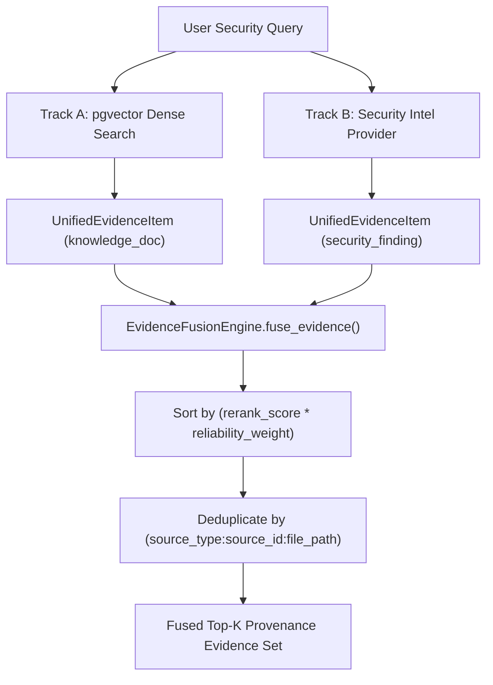

# NOVA Technical Evidence — 01: Dual-Track Evidence Fusion & Provenance

> **Component**: Evidence Acquisition & Unified Evidence Fusion Engine  
> **Modules**: [evidence_fusion.py](file:///c:/Users/kalya/OneDrive/Desktop/Nlp/NOVA/backend/app/services/assistant/evidence_fusion.py), [assistant_service.py](file:///c:/Users/kalya/OneDrive/Desktop/Nlp/NOVA/backend/app/services/assistant/assistant_service.py)  
> **Status**: IMPLEMENTED & VERIFIED  

---

## 1. Problem Statement

Generic Retrieval-Augmented Generation (RAG) models pull text chunks solely from unstructured vector databases. In cybersecurity intelligence, answers require **both** unstructured organizational material (policies, standards, manuals) and **structured machine-readable technical facts** (vulnerability assessments, AST findings, active controls). Relying solely on unstructured vector search results in hallucinated or ungrounded security advice.

## 2. Existing Architectural Limitation

Traditional architectures either query an LLM directly without structured context or query an isolated vulnerability scanner database. Neither unifies heterogeneous sources into a normalized representation while preserving source-specific provenance for downstream reasoning.

## 3. NOVA Mechanism

NOVA implements a **Dual-Track Evidence Acquisition & Fusion Pipeline**:
- **Track A (Knowledge Track)**: Embedding-based pgvector dense retrieval over structured document chunks.
- **Track B (Security Intelligence Track)**: Machine-readable security assessments, observations, and posture metrics from the security intelligence service.

Both tracks are transformed into normalized `UnifiedEvidenceItem` objects and passed to the `EvidenceFusionEngine` for weighted reranking, deduplication, and provenance tracking.



## 4. Data Flow & Input/Output Schema

### Inputs
- User query string
- Candidate knowledge chunks from vector store
- Security intelligence findings and posture metrics

### Processing Steps
1. `format_knowledge_chunk_as_evidence()` extracts chunk content, headings, section paths, page numbers, and document metadata into `provenance`.
2. `format_finding_as_evidence()` extracts vulnerability severity, CWE, CVE, line numbers, and scanner confidence ($C_{\text{finding}} = 1.0 - \prod (1.0 - c_i)$).
3. `fuse_evidence()` combines both lists, computes `weighted_score = rerank_score * reliability_weight`, deduplicates by composite key, and selects top-K candidates.

### Output
A `List[UnifiedEvidenceItem]` retaining complete citation information:
```json
{
  "source_type": "security_finding",
  "source_id": "sec-intel-001",
  "title": "Verified Risk Assessment: PRIVILEGE_ESCALATION_RISK",
  "file_path": "backend/app/api/v1/admin.py",
  "cwe_id": "CWE-285",
  "severity": "HIGH",
  "similarity_score": 0.94,
  "rerank_score": 0.94,
  "provenance": {
    "provider": "security_intelligence_service",
    "scanner_confidence": 0.94,
    "status": "OPEN"
  }
}
```

## 5. Deterministic Rules
- **Cross-Scanner Confidence Boost**: Multi-scanner evidence receives non-linear boost $1.0 - \prod (1.0 - c_i)$.
- **Reliability Weighting**: `faq_axiom` (1.0) > `security_finding` (0.95) = `official_doc` (0.95) > `knowledge_doc` (0.85) > `user_doc` (0.80) > `web_search` (0.70).
- **Composite Key Deduplication**: Uniqueness enforced on `f"{source_type}:{source_id}:{file_path}"`.

## 6. Interaction With Downstream Components
The fused evidence set forms the input to:
1. `nli_engine.py` for pairwise semantic relationship analysis.
2. `consensus_engine.py` for evidence agreement scoring ($C_{\text{agreement}}$).
3. `calibrator.py` for 8D confidence vector computation.

## 7. Verification & Tests
- [test_evidence_fusion_integration.py](file:///c:/Users/kalya/OneDrive/Desktop/Nlp/NOVA/backend/tests/test_evidence_fusion_integration.py)
- [test_patent_differentiating_interactions.py](file:///c:/Users/kalya/OneDrive/Desktop/Nlp/NOVA/backend/tests/test_patent_differentiating_interactions.py) (`test_14_dual_track_evidence_fusion_provenance`)
