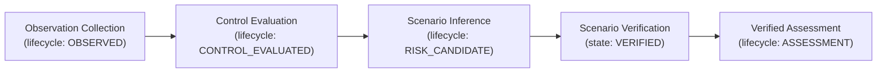

# NOVA Technical Evidence — 02: Security Intelligence Pipeline & State Lifecycle

> **Component**: Independent Security Intelligence Orchestration Engine  
> **Modules**: [intelligence_orchestrator.py](file:///c:/Users/kalya/OneDrive/Desktop/Nlp/NOVA/backend/app/services/security_intelligence/intelligence_orchestrator.py), [observation_collector.py](file:///c:/Users/kalya/OneDrive/Desktop/Nlp/NOVA/backend/app/services/security_intelligence/observation_collector.py), [control_analyzer.py](file:///c:/Users/kalya/OneDrive/Desktop/Nlp/NOVA/backend/app/services/security_intelligence/control_analyzer.py), [risk_scenario_engine.py](file:///c:/Users/kalya/OneDrive/Desktop/Nlp/NOVA/backend/app/services/security_intelligence/risk_scenario_engine.py), [scenario_verifier.py](file:///c:/Users/kalya/OneDrive/Desktop/Nlp/NOVA/backend/app/services/security_intelligence/scenario_verifier.py)  
> **Status**: IMPLEMENTED & VERIFIED  

---

## 1. Problem Statement

Vulnerability management tools often conflate raw technical observations (e.g. "endpoint accepts POST request") or hypothetical attack paths with verified security vulnerabilities. Treating unverified hypotheses as confirmed security risks inflates false positives and misleads security engineering teams.

## 2. Existing Architectural Limitation

Conventional scanners directly output finding alerts without maintaining a formal state transition lifecycle or distinguishing candidate hypotheses from verified assessments.

## 3. NOVA Mechanism

NOVA enforces an explicit 5-stage lifecycle for security facts:
$$\text{OBSERVED} \longrightarrow \text{CONTROL\_EVALUATED} \longrightarrow \text{RISK\_CANDIDATE} \longrightarrow \text{VERIFIED} \longrightarrow \text{ASSESSMENT}$$

## 4. Pipeline Stages & Data Flow

1. **Asset Discovery** (`asset_discovery_service.py`): Identifies application, API, database, and service assets with criticality levels (`CRITICAL`, `HIGH`, `MEDIUM`, `LOW`).
2. **Observation Collection** (`observation_collector.py`): Uses Python AST parsing (`ast.parse()`) for source files to extract structural security facts (`PUBLIC_ENDPOINT`, `USER_CONTROLLED_INPUT`, `AUTHENTICATION_BOUNDARY`, `SECRET_USAGE`, `DATABASE_ACCESS`).
3. **Control Analysis** (`control_analyzer.py`): Analyzes code AST to evaluate active controls (`AUTHORIZATION`, `AUTHENTICATION`, `INPUT_VALIDATION`, `SECRET_MANAGEMENT`) into states (`PRESENT`, `ABSENT`, `PARTIAL`, `BYPASSED`).
4. **Risk Scenario Inference** (`risk_scenario_engine.py`): Synthesizes observations and control states to infer risk hypotheses in `CANDIDATE` verification state.
5. **Scenario Verification** (`scenario_verifier.py`): Cross-references control evaluations against candidate scenarios to confirm or downgrade severity, producing `VerifiedAssessmentData` (`status="OPEN"`, `verification_state="VERIFIED"`).

## 5. Deterministic Rules
- An observation represents a neutral technical fact (`provenance: code_ast_fact` or `fastapi_route_ast`), never a vulnerability.
- A risk scenario MUST remain in `verification_state="CANDIDATE"` until verified against evaluated control states.
- If an authorization control (`RequireRole`) is `PRESENT`, privilege escalation scenarios are downgraded to `LOW` severity with `SUPPORTED` status rather than `HIGH` severity.

## 6. Verification & Tests
- [test_security_intelligence_service.py](file:///c:/Users/kalya/OneDrive/Desktop/Nlp/NOVA/backend/tests/test_security_intelligence_service.py)
- [test_patent_differentiating_interactions.py](file:///c:/Users/kalya/OneDrive/Desktop/Nlp/NOVA/backend/tests/test_patent_differentiating_interactions.py) (`test_1_observation_vs_assessment_lifecycle`)
