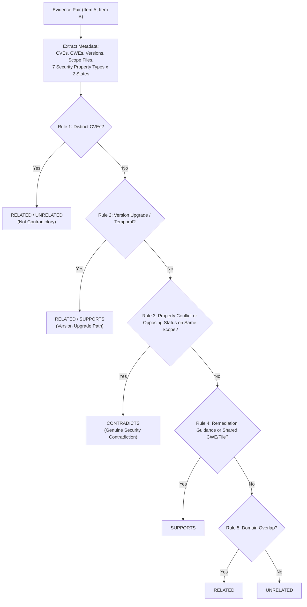

# NOVA Technical Evidence — 03: Property/Version-Aware NLI Reasoning

> **Component**: NLI-Based Pairwise Evidence Relationship Engine  
> **Modules**: [nli_engine.py](file:///c:/Users/kalya/OneDrive/Desktop/Nlp/NOVA/backend/app/services/ai/nli_engine.py), [consensus_engine.py](file:///c:/Users/kalya/OneDrive/Desktop/Nlp/NOVA/backend/app/services/ai/consensus_engine.py)  
> **Status**: IMPLEMENTED & VERIFIED  

---

## 1. Problem Statement

Standard Natural Language Inference (NLI) models classify sentence pairs into `ENTAILMENT`, `CONTRADICTION`, or `NEUTRAL` based strictly on generic textual semantics. In technical security domains, text statements that appear superficially contradictory often describe different software versions (e.g. "v1.2 vulnerable" vs "v1.4 fixed") or distinct security properties (e.g. `AUTHENTICATION` vs `ENCRYPTION`). Standard NLI incorrectly flags version upgrades or scope differences as critical evidence contradictions.

## 2. Existing Architectural Limitation

Generic NLI systems lack domain-aware metadata parsing, regex-based security property extraction, CVE/CWE scope matching, and version comparison hierarchies.

## 3. NOVA Mechanism

NOVA's `NLIEngine` combines neural cross-encoder scores with structured metadata extraction, security property conflict rules, version comparison, and temporal context qualification through a **6-Rule Decision Hierarchy**.

## 4. Security Property Extraction Patterns

The engine extracts 7 core security property types:
- `AUTHENTICATION`: `VULNERABLE` (missing/no verify) vs `SAFE` (requires auth, validates TLS)
- `AUTHORIZATION`: `VULNERABLE` (bypass, broken access) vs `SAFE` (enforces ownership, restricts routes)
- `ENCRYPTION`: `VULNERABLE` (unencrypted, plaintext) vs `SAFE` (forces https, encrypts credentials)
- `INPUT_VALIDATION`: `VULNERABLE` (unsanitized input) vs `SAFE` (parameterized queries, sanitizes)
- `SECRET_MANAGEMENT`: `VULNERABLE` (hardcoded secret) vs `SAFE` (environment variables, vault)
- `CSRF_SESSION`: `VULNERABLE` (missing csrf) vs `SAFE` (validates csrf, samesite=strict)
- `MEMORY_COMMAND`: `VULNERABLE` (buffer overflow, unquoted path) vs `SAFE` (shell=false, quoted)

## 5. 6-Rule Decision Hierarchy

1. **Distinct CVE Identifiers**: If items refer to different CVE IDs (e.g. `CVE-2023-1234` vs `CVE-2024-9999`), classified as `RELATED` or `UNRELATED`, preventing false contradiction flags.
2. **Version Upgrade / Temporal Context**: If items refer to different software versions (e.g. `PyYAML v5.3` vs `v5.4`) or contain temporal markers (`historical`, `deprecated`, `previously`), classified as `RELATED` (upgrade/evolution path).
3. **Property Conflict & Opposing Status**: If items assert opposing states on the same security property, same version, or same file scope, classified as `CONTRADICTS`.
4. **Remediation Guidance**: Remediation text (e.g. "To fix SQL injection, use parameterized queries") paired with vulnerability findings is classified as `SUPPORTS`.
5. **Domain Overlap**: Shared domain vocabulary without state conflict is classified as `RELATED`.
6. **Default**: Unrelated text passages are classified as `UNRELATED`.

## 6. Verification & Tests
- [test_nli_version_contradiction.py](file:///c:/Users/kalya/OneDrive/Desktop/Nlp/NOVA/backend/tests/test_nli_version_contradiction.py) (321 lines, 30+ test cases)
- [test_nli_implicit_contradiction.py](file:///c:/Users/kalya/OneDrive/Desktop/Nlp/NOVA/backend/tests/test_nli_implicit_contradiction.py)
- [test_patent_differentiating_interactions.py](file:///c:/Users/kalya/OneDrive/Desktop/Nlp/NOVA/backend/tests/test_patent_differentiating_interactions.py) (`test_2`, `test_3`, `test_4`, `test_5`)
