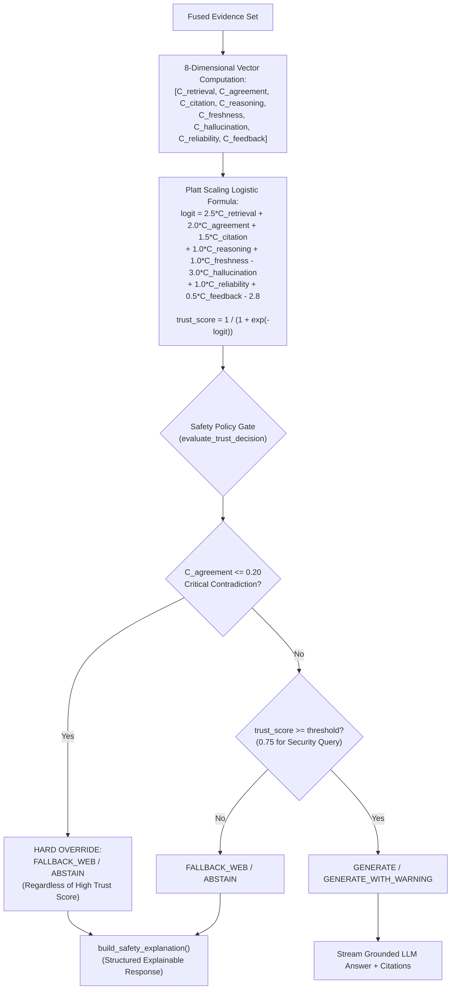

# NOVA Technical Evidence — 04: Multi-Dimensional Trust Calibration & Explainable Safety Gate

> **Component**: 8D Confidence Calibrator & Decoupled Safety Policy Gate  
> **Modules**: [calibrator.py](file:///c:/Users/kalya/OneDrive/Desktop/Nlp/NOVA/backend/app/services/search_analytics/calibrator.py), [assistant_service.py](file:///c:/Users/kalya/OneDrive/Desktop/Nlp/NOVA/backend/app/services/assistant/assistant_service.py)  
> **Status**: IMPLEMENTED & VERIFIED  

---

## 1. Problem Statement

AI decision systems that use raw similarity scores (e.g., vector search cosine distance) to authorize generation suffer from hallucination and unsafe answers. A retrieved document chunk may have high vector similarity while being stale, contradictory to other evidence, or lacking citation support. Furthermore, equating statistical confidence directly with authorization allows unsafe or contradictory conclusions to be streamed to users.

## 2. Existing Architectural Limitation

Most RAG systems lack multi-dimensional quality scaling and fail to separate statistical confidence estimation from deterministic safety enforcement.

## 3. NOVA Mechanism

NOVA implements a two-stage decoupled control model:
1. **Multi-Dimensional Trust Calibration**: Computes an 8-dimensional evidence-quality vector and applies Platt-scaled logistic calibration to compute a trust probability $P(\text{Trust} \mid C) \in [0, 1]$.
2. **Decoupled Safety Policy Gate**: Uses the calibrated trust score alongside explicit hard safety conditions ($C_{\text{agreement}} \le 0.20$ critical contradiction override) to determine output authorization.

$$\text{Statistical Trust Score} \neq \text{Authorization to Generate}$$

## 4. 8-Dimensional Confidence Vector Formulation

$$\mathbf{C} = \begin{bmatrix} C_{\text{retrieval}} & C_{\text{agreement}} & C_{\text{citation}} & C_{\text{reasoning}} & C_{\text{freshness}} & C_{\text{hallucination\_risk}} & C_{\text{source\_reliability}} & C_{\text{user\_feedback}} \end{bmatrix}$$

- $C_{\text{retrieval}}$: Dense retrieval similarity from pgvector store.
- $C_{\text{agreement}}$: Pairwise NLI evidence consensus score ($0.50 - 0.40 \times N_{\text{contradicts}}$ or $0.85 + 0.05 \times N_{\text{supports}}$).
- $C_{\text{citation}}$: Citation coverage ratio ($\min(|Citations| / TopK, 1.0)$).
- $C_{\text{reasoning}}$: Structural evidence completeness ($0.60 + 0.30 \times ratio + complexity\_bonus$).
- $C_{\text{freshness}}$: Exponential age decay $\exp(-\lambda \times age\_days)$ with $\lambda = 0.005$.
- $C_{\text{hallucination\_risk}}$: Support mismatch risk $1.0 - (0.5 C_{\text{retrieval}} + 0.3 C_{\text{agreement}} + 0.2 C_{\text{citation}})$.
- $C_{\text{source\_reliability}}$: Weighted source reliability (`faq_axiom`: 1.0, `security_finding`: 0.95, `official_doc`: 0.95, `knowledge_doc`: 0.85, `user_doc`: 0.80, `web_search`: 0.70).
- $C_{\text{user\_feedback}}$: Historical feedback score prior (default 0.50).

## 5. Platt Scaling Calibration Equation

$$\text{logit} = 2.5 C_{\text{retrieval}} + 2.0 C_{\text{agreement}} + 1.5 C_{\text{citation}} + 1.0 C_{\text{reasoning}} + 1.0 C_{\text{freshness}} - 3.0 C_{\text{hallucination\_risk}} + 1.0 C_{\text{source\_reliability}} + 0.5 C_{\text{user\_feedback}} - 2.8$$

$$P(\text{Trust}) = \frac{1}{1 + e^{-\text{logit}}}$$

## 6. Safety Gate Explainability Output

When generation is restricted or overridden, `build_safety_explanation()` produces a structured response detailing:
- `decision`: `FALLBACK_WEB` or `ABSTAIN`
- `policy_trigger`: `CRITICAL_CONTRADICTION`, `SECURITY_QUERY_LOW_CONFIDENCE`, or `LOW_RETRIEVAL_SIMILARITY`
- `contradiction_count`: Exact count of opposing evidence pairs
- `contradicting_evidence`: Exact formatting of conflicting evidence items with line numbers, CWE/CVE IDs, and security properties
- `explanation`: Detailed natural-language rationale rendered in UI via `SafetyGateBanner.tsx`.

## 7. Verification & Tests
- [test_safety_gate_explainability.py](file:///c:/Users/kalya/OneDrive/Desktop/Nlp/NOVA/backend/tests/test_safety_gate_explainability.py) (354 lines)
- [test_patent_differentiating_interactions.py](file:///c:/Users/kalya/OneDrive/Desktop/Nlp/NOVA/backend/tests/test_patent_differentiating_interactions.py) (`test_7`, `test_8`, `test_9`)
