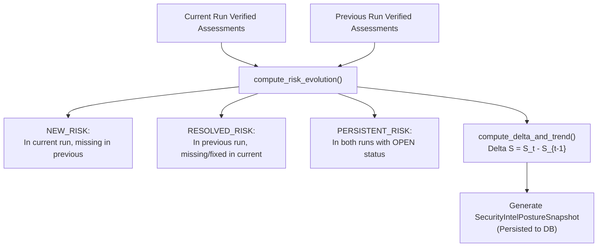

# NOVA Technical Evidence — 05: Temporal Posture Trend & Remediation Verification

> **Component**: Temporal Posture Engine & AST Remediation Verifier  
> **Modules**: [posture_trend_engine.py](file:///c:/Users/kalya/OneDrive/Desktop/Nlp/NOVA/backend/app/services/security_intelligence/posture_trend_engine.py), [remediation_verifier.py](file:///c:/Users/kalya/OneDrive/Desktop/Nlp/NOVA/backend/app/services/security_intelligence/remediation_verifier.py)  
> **Status**: IMPLEMENTED & VERIFIED  

---

## 1. Problem Statement

1. **Single-Point Vulnerability Scans**: Conventional scanners present point-in-time risk reports without quantifying security posture trajectories over time or classifying whether findings represent new exposures, persistent technical debt, or verified fixes.
2. **Unverified Remediation Suggestions**: Generating a security fix recommendation (e.g., "add authentication middleware") does not prove that the code was actually modified or remediated. Marking an assessment resolved without technical evidence leads to regression vulnerabilities.

## 2. Existing Architectural Limitation

Legacy systems lack temporal delta scoring over verified assessment sets and fail to require technical code verification before transitioning assessment status from `OPEN` to `VERIFIED_FIXED`.

## 3. NOVA Mechanism

### A. Temporal Security Posture Engine
Computes deterministic posture deltas ($\Delta S = S_t - S_{t-1}$) and classifies risk evolution strictly over verified security assessments:
$$\Delta S = S_{\text{current}} - S_{\text{previous}}$$

- $\Delta S > +1.0 \implies \text{IMPROVED}$
- $\Delta S < -1.0 \implies \text{DEGRADED}$
- $|\Delta S| \le 1.0 \implies \text{UNCHANGED}$



### B. Remediation Verification Engine
Distinguishes between a recommended fix and a verified fix:
$$\text{RECOMMENDED FIX} \neq \text{VERIFIED FIX}$$

When a user or developer submits a code snippet, `RemediationVerifierService` parses the AST (`ast.parse()`) and inspects structural patterns to verify that required security controls (e.g. `Depends(RequireRole('admin'))`, `Pydantic` input validation, parameterized queries) are present in the updated code before transitioning status to `VERIFIED_FIXED`.

## 4. Risk Evolution Data Schema

```json
{
  "status": "EVALUATED",
  "new_risks_count": 1,
  "resolved_risks_count": 1,
  "persistent_risks_count": 1,
  "new_risks": [
    {"risk_type": "XSS_VULNERABILITY", "affected_scope": "view.py", "severity": "HIGH"}
  ],
  "resolved_risks": [
    {"risk_type": "SECRET_LEAK", "affected_scope": "config.py", "severity": "MEDIUM"}
  ],
  "persistent_risks": [
    {"risk_type": "SQL_INJECTION", "affected_scope": "auth.py", "severity": "HIGH"}
  ]
}
```

## 5. Verification & Tests
- [test_temporal_posture_engine.py](file:///c:/Users/kalya/OneDrive/Desktop/Nlp/NOVA/backend/tests/test_temporal_posture_engine.py) (164 lines, 15+ tests)
- [test_security_intelligence_service.py](file:///c:/Users/kalya/OneDrive/Desktop/Nlp/NOVA/backend/tests/test_security_intelligence_service.py) (`test_remediation_verifier`)
- [test_patent_differentiating_interactions.py](file:///c:/Users/kalya/OneDrive/Desktop/Nlp/NOVA/backend/tests/test_patent_differentiating_interactions.py) (`test_10_11_12`, `test_13`)
