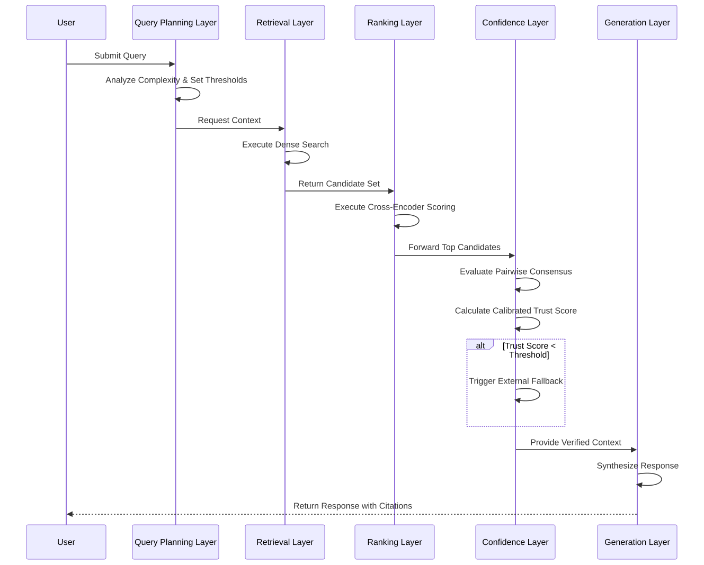

  
# Vellore Institute of Technology
  
## Literature Review and Proposed Architecture Report
  
**Project Title:**  
Adaptive Enterprise Knowledge Operating Framework (AEKOF)
  
**Course:**  
Natural Language Processing
  
**Course Code:**  
ISWE310L
  
    
  
**Prepared by:**  
[Student Name 1] - [Registration Number 1]  
[Student Name 2] - [Registration Number 2]  
[Student Name 3] - [Registration Number 3]  

  

**Submitted to:**  
[Faculty Name]
  
**Submission Date:**  
[Date]

## Table of Contents

*(Generated automatically by the document processor)*

## 1. Introduction

Retrieval-Augmented Generation (RAG) has emerged as a prominent paradigm for augmenting Large Language Models (LLMs) with external knowledge. However, traditional RAG systems deployed in enterprise environments often encounter structural limitations, including static retrieval pipelines, uncalibrated confidence leading to hallucinations, and an inability to resolve conflicting information. In mission-critical applications, presenting an unverified or low-confidence response introduces significant operational risk.

The Adaptive Enterprise Knowledge Operating Framework (AEKOF) is motivated by the need for a deterministic, robust, and calibrated retrieval system. The primary objective of AEKOF is to orchestrate a multi-stage evidence cascade that verifies knowledge consensus prior to generation. By integrating task-decomposed query planning, pairwise Natural Language Inference (NLI) consensus verification, and multi-dimensional trust modeling, the framework mitigates the risk of hallucinations and enhances response reliability. When internal confidence is insufficient, the system facilitates a controlled external web search fallback. This report reviews foundational literature, proposes an architectural pipeline based on these concepts, and discusses potential methodologies for evaluation.

---

## 2. Literature Review

### 2.1 Adaptive-RAG
**Problem addressed:** Traditional RAG systems apply a uniform retrieval pipeline to all queries, which can be computationally inefficient for simple queries and inadequate for complex reasoning tasks.  
**Proposed solution:** A dynamic routing mechanism that categorizes query complexity to determine the optimal retrieval strategy, thereby allocating computational resources more effectively.  
**Strengths:** Reduces latency and computational overhead while improving accuracy for complex queries.  
**Limitations:** The effectiveness is highly dependent on the accuracy of the underlying query classifier.  
**How AEKOF incorporates or extends the idea:** The architecture incorporates a query planning layer that evaluates query complexity based on linguistic heuristics. This layer dynamically adjusts timeout thresholds, confidence requirements, and selects active retrieval paths to optimize the execution strategy.

### 2.2 Self-RAG
**Problem addressed:** RAG models often exhibit blind trust in retrieved information, leading to hallucinations if the retrieval quality is poor or contextually irrelevant.  
**Proposed solution:** Fine-tuning the LLM to generate reflection tokens that self-evaluate whether retrieval is necessary and whether the retrieved context adequately supports the generation.  
**Strengths:** Improves output reliability and faithfulness without relying on external evaluators.  
**Limitations:** Requires costly model fine-tuning, increases inference latency, and restricts the choice of foundational models.  
**How AEKOF incorporates or extends the idea:** Rather than relying on autoregressive reflection tokens, the architecture employs a deterministic consensus module. This module evaluates pairwise agreement across retrieved contexts prior to generation, significantly reducing the probability of the model processing conflicting data.

### 2.3 GraphRAG
**Problem addressed:** Standard dense retrieval mechanisms frequently fail to capture global context and multi-hop relationships across extensive document corpora.  
**Proposed solution:** Extracting entities and relationships into a Knowledge Graph (KG) and retrieving interconnected subgraphs to provide holistic, structured context.  
**Strengths:** Excels at complex reasoning, "connecting the dots," and answering global summarization queries.  
**Limitations:** Graph construction is computationally expensive, and maintaining graph integrity during updates presents significant engineering challenges.  
**How AEKOF incorporates or extends the idea:** The current architecture includes foundational data models designed for future GraphRAG integration. The active retrieval phase currently prioritizes dense vector approaches, while graph traversal is reserved as a future architectural extension.

### 2.4 LightRAG
**Problem addressed:** Comprehensive GraphRAG implementations often suffer from high latency and substantial computational costs during both graph construction and retrieval.  
**Proposed solution:** A dual-level retrieval system that combines low-level entity retrieval with high-level relationship retrieval, facilitating faster graph traversal.  
**Strengths:** Reduces retrieval latency compared to exhaustive GraphRAG methodologies while preserving relationship awareness.  
**Limitations:** Performance remains dependent on the quality and accuracy of the initial entity extraction phase.  
**How AEKOF incorporates or extends the idea:** Dual-level graph retrieval is designed for future integration. The current system maintains compatibility with this paradigm while optimizing performance through single-stage dense retrieval.

### 2.5 HyDE (Hypothetical Document Embeddings)
**Problem addressed:** There is frequently a semantic mismatch between short, ambiguous user queries and long, detailed document chunks in the knowledge base.  
**Proposed solution:** Utilizing an LLM to generate a hypothetical answer to the query, embedding that answer, and retrieving documents similar to the hypothetical embedding.  
**Strengths:** Effectively bridges the semantic gap without requiring explicit relevance labels or query rewriting.  
**Limitations:** Introduces additional generation latency and risks retrieving off-topic documents if the hypothetical answer hallucinates.  
**How AEKOF incorporates or extends the idea:** The current implementation prioritizes low-latency retrieval by embedding raw user queries directly. Hypothetical document generation is reserved as a potential future extension for domain-specific adaptations where latency constraints are less strict.

### 2.6 CRAG (Corrective Retrieval Augmented Generation)
**Problem addressed:** The introduction of irrelevant retrieved documents into the LLM context window severely degrades generation quality and factuality.  
**Proposed solution:** A lightweight retrieval evaluator assesses document relevance. If internal documents are deemed incorrect or ambiguous, the system triggers a large-scale web search as a corrective fallback mechanism.  
**Strengths:** Highly robust against incomplete or low-quality internal knowledge bases.  
**Limitations:** Web search can introduce unverified external data and variable latency.  
**How AEKOF incorporates or extends the idea:** The framework natively adopts the corrective philosophy through a trust calibration layer. If the calibrated trust score falls below a dynamically determined threshold, the system triggers an external search fallback mechanism to retrieve supplementary context prior to generation.

### 2.7 MemoRAG
**Problem addressed:** Standard RAG pipelines lack long-term context retention, limiting their utility in multi-turn, complex reasoning tasks.  
**Proposed solution:** A dual-system architecture utilizing a memory model to build a global memory representation over the database, guiding subsequent retrieval and generation.  
**Strengths:** Maintains state and contextual awareness over extended horizons.  
**Limitations:** Imposes significant memory overhead and requires complex state management infrastructure.  
**How AEKOF incorporates or extends the idea:** The architecture features a session management module that injects historical conversational context into the prompt. Global memory retrieval over the entire corpus maintains compatibility with future architectural expansions.

### 2.8 LongRAG
**Problem addressed:** Segmenting documents into small chunks often destroys macroscopic document-level context and narrative continuity.  
**Proposed solution:** Leveraging LLMs with massive context windows to retrieve and process entire documents or exceedingly long chunks, preserving structural integrity.  
**Strengths:** Preserves document integrity and facilitates macro-structural reasoning.  
**Limitations:** Entails exceedingly high token costs, increases inference latency, and may exceed the effective attention span of the LLM.  
**How AEKOF incorporates or extends the idea:** The current framework utilizes granular document segmentation. This approach optimizes for low token usage and precise cross-encoder reranking, while processing of full-length documents remains a consideration for future iterations.

### 2.9 Reciprocal Rank Fusion (RRF)
**Problem addressed:** Integrating and normalizing results from multiple disparate retrieval algorithms (e.g., dense vector search and sparse lexical search) poses a significant ranking challenge.  
**Proposed solution:** An algorithm that combines ranked lists by assigning scores based on the inverse of their rank position, effectively smoothing out anomalies and highlighting consistent documents.  
**Strengths:** Simple, parameter-free, and highly effective for standardizing hybrid search results.  
**Limitations:** Can be suboptimal if one retrieval method is significantly more accurate than the others.  
**How AEKOF incorporates or extends the idea:** RRF is designed for future integration alongside sparse and graph retrieval models. The current system focuses on optimizing a single dense retrieval pipeline, rendering fusion algorithms unnecessary at this stage.

### 2.10 Platt Scaling / Confidence Calibration
**Problem addressed:** Classifier and retrieval distance scores are often uncalibrated and do not represent true statistical probabilities, making thresholding unreliable.  
**Proposed solution:** Applying logistic regression (Platt scaling) to model outputs to transform raw scores into reliable, bounded probability distributions.  
**Strengths:** Yields mathematically sound confidence scores that can be used for reliable decision-making.  
**Limitations:** Requires careful tuning of weights and biases to prevent overconfidence or underconfidence.  
**How AEKOF incorporates or extends the idea:** The framework includes a dedicated confidence calibration module that applies logistic scaling to a multi-dimensional feature vector (incorporating retrieval scores, consensus metrics, and citation coverage) to produce a definitive, normalized trust probability.

## 3. Comparative Analysis

Table 1 summarizes the core contributions, addressed problems, limitations, and the specific relationship of each methodology to the AEKOF framework.

**Table 1. Comparative Analysis of Foundational Literature**

| Paper | Core Contribution | Problem Solved | Limitations | Relation to AEKOF |
| :--- | :--- | :--- | :--- | :--- |
| **Adaptive-RAG** | Query complexity routing | Inefficient static retrieval | Dependent on accurate classification | Adapted via a heuristic query planning layer |
| **Self-RAG** | Autoregressive reflection | Blind trust in retrieved data | High fine-tuning and latency costs | Substituted with a deterministic consensus layer |
| **GraphRAG** | Subgraph context retrieval | Loss of macroscopic context | High extraction and maintenance cost | Designed for future architectural integration |
| **LightRAG** | Dual-level graph traversal | Graph retrieval latency | Relies on initial extraction quality | Reserved as a future architectural extension |
| **HyDE** | Hypothetical embeddings | Semantic query-document mismatch | Introduces pre-retrieval latency | Current focus on direct query embedding |
| **CRAG** | Evaluation and web fallback | Degradation from poor retrieval | External data reliability risks | Implemented via calibrated corrective fallback |
| **MemoRAG** | Global memory models | Lack of multi-turn state retention | Significant computational overhead | Implemented via session context injection |
| **LongRAG** | Unsegmented retrieval | Destruction of narrative continuity | High token utilization | Current focus on granular chunk optimization |
| **RRF** | Multi-list rank fusion | Normalization of hybrid results | Assumes comparable list quality | Designed for future hybrid search integration |
| **Platt Scaling** | Logistic score calibration | Unreliable raw retrieval scores | Requires precise weight optimization | Implemented via multi-dimensional calibration |

## 4. Proposed Architecture

The proposed architecture of the AEKOF system is modular and strictly layered, separating retrieval concerns from generation and evaluation. The comprehensive flow, components, and sequences are illustrated in Figures 1, 2, and 3.

### 4.1 Query Planning Layer
**Purpose:** Analyzes incoming queries to establish execution parameters, dynamically routing the request based on linguistic complexity.  
**Inputs:** Natural language user query.  
**Outputs:** An execution plan defining the complexity classification, timeout constraints, and required confidence thresholds.  
**Interaction:** Operates as the entry point, directly influencing the stringency of the Confidence Layer and the active paths in the Retrieval Layer.  
**Design rationale:** Reduces computational waste by preventing complex retrieval operations for simple factual queries, enhancing overall system throughput.

### 4.2 Retrieval Layer
**Purpose:** Identifies and extracts semantically relevant information from the indexed knowledge corpus.  
**Inputs:** Embedded representation of the user query.  
**Outputs:** A candidate set of document segments.  
**Interaction:** Receives execution parameters from the Query Planning Layer and passes candidates forward to the Ranking Layer.  
**Design rationale:** Utilizes dense vector similarity to prioritize semantic intent over lexical matching, providing a foundational baseline of relevant context.

### 4.3 Ranking Layer
**Purpose:** Refines and reorders the initial candidate set to surface the most contextually appropriate segments.  
**Inputs:** User query and raw text of candidate segments.  
**Outputs:** A strictly ordered list of segments with updated relevance scores.  
**Interaction:** Acts as an intermediary, filtering the broad results of the Retrieval Layer before computationally intensive evaluation by the Confidence Layer.  
**Design rationale:** Decouples fast, coarse retrieval (bi-encoders) from slower, highly accurate scoring (cross-encoders), optimizing the balance between latency and precision.

### 4.4 Confidence Layer
**Purpose:** Evaluates the integrity, consensus, and sufficiency of the ranked evidence to determine if it is safe to proceed to generation.  
**Inputs:** Ranked document segments, relevance scores, and internal consensus metrics derived from pairwise semantic overlap.  
**Outputs:** A normalized trust probability and a binary routing decision (sufficient vs. insufficient).  
**Interaction:** Gates access to the Generation Layer. If the trust probability fails to meet the threshold set by the Query Planning Layer, it triggers a corrective external retrieval mechanism.  
**Design rationale:** Mitigates hallucinations by ensuring the LLM is only provided with mathematically verified, non-contradictory information.

### 4.5 Generation Layer
**Purpose:** Synthesizes the final natural language response based on verified evidence.  
**Inputs:** Conversational history, verified document segments, and the user query.  
**Outputs:** The final response text.  
**Interaction:** Receives only vetted context from the Confidence Layer, ensuring high faithfulness to the source material.  
**Design rationale:** Isolates the non-deterministic LLM generation at the very end of the pipeline, strictly constraining its operational boundaries to the provided context.

### 4.6 Citation Layer
**Purpose:** Grounds the generated response in verifiable source material, ensuring traceability.  
**Inputs:** Metadata associated with the utilized document segments.  
**Outputs:** Structured reference data appended to the final response.  
**Interaction:** Operates in parallel with the Generation Layer, mapping text spans to their origin points.  
**Design rationale:** Enhances user trust and facilitates auditing by providing transparent links to enterprise source documents.

## 5. Architecture Diagrams

### 5.1 System Architecture Flowchart

As shown in Figure 1, the overall architecture of the proposed framework orchestrates a multi-stage execution pipeline. It begins with the user query and routes through the various verification and retrieval layers before culminating in a grounded generation.

### 5.2 Component Architecture Diagram

As shown in Figure 2, the retrieval subsystem and other modular boundaries illustrate the integration points across the core framework, separating knowledge management from orchestration and synthesis.

### 5.3 Sequence Diagram of the Execution Pipeline

As depicted in Figure 3, the chronological execution ensures that external corrective fallbacks are only triggered following rigorous internal evaluation.

## 6. Novel Contributions

The proposed architecture introduces several methodological enhancements to standard RAG deployments:

1. **Multi-Dimensional Confidence Calibration:** By moving beyond raw vector distance, the architecture scales multiple semantic features into a unified probabilistic trust score. This facilitates rigorous thresholding policies in enterprise settings.
2. **Pre-Generation Consensus Verification:** Implementing NLI-inspired pairwise comparison matrices allows the system to detect and penalize contradictory evidence before it reaches the language model, preemptively reducing hallucination rates.
3. **Adaptive Corrective Routing:** The integration of dynamic thresholds based on query complexity ensures that corrective mechanisms (such as web fallbacks) are only invoked when mathematically justified, optimizing both latency and data reliability.

---

## 7. Proposed Methodology

The standard operational sequence of the proposed architecture is defined as follows:

1. **Intent Analysis:** The incoming natural language query undergoes linguistic analysis to classify its complexity, which dictates the operational constraints for subsequent layers.
2. **Deterministic Evaluation:** The system first evaluates the query against predefined knowledge rules. If a high-confidence match is detected, the pipeline resolves immediately.
3. **Semantic Extraction:** The query is transformed into a dense vector representation and compared against the indexed corpus to extract a broad candidate set of informational segments.
4. **Precision Ranking:** A deep semantic interaction model re-evaluates the candidate set against the query, ordering the segments by relevance.
5. **Consensus and Calibration:** The top segments are cross-referenced for internal consistency. The resulting metrics are mathematically scaled to produce a final trust probability.
6. **Corrective Action (Conditional):** If the trust probability is deemed insufficient, the system supplements the internal data with controlled external retrieval.
7. **Synthesis and Grounding:** The verified information, along with conversational context, is processed by the language model to synthesize the final output, which is strictly annotated with traceable citations.

---

## 8. Technology Stack

Table 2 provides a high-level overview of the underlying technology stack facilitating the AEKOF architecture.

**Table 2. Technology Stack Overview**

| Layer | Component Category | Academic/Technical Purpose |
| :--- | :--- | :--- |
| **API** | High-Performance HTTP Server | Facilitates asynchronous communication and endpoint orchestration |
| **Database** | Relational SQL Datastore | Manages structured metadata, session history, and relational schemas |
| **Vector Database** | Native Vector Extension | Enables high-throughput approximate nearest neighbor (ANN) and cosine similarity search |
| **Embedding / Reranking** | Local Inference Engine | Executes bi-encoder and cross-encoder models for embedding and precision ranking |
| **LLMs** | Model Gateway | Interfaces with foundational language models for natural language synthesis |
| **Workers** | Asynchronous Task Queue | Processes background indexing, graph extraction, and data ingestion tasks |

## 9. Future Work

The current architecture provides a robust foundation for enterprise knowledge retrieval, but several avenues remain open for future expansion:

*   **GraphRAG Integration:** Activating the existing schema designs to extract and traverse knowledge graphs, enabling the system to answer complex, multi-hop queries that require global corpus context.
*   **LightRAG Methodology:** Adopting a dual-level entity and relationship retrieval mechanism to optimize the latency of future graph traversal operations.
*   **Hybrid BM25 + Dense Retrieval:** Incorporating sparse lexical retrieval (BM25) alongside dense vectors, fused via Reciprocal Rank Fusion (RRF), to improve recall for exact keyword matches and domain-specific acronyms.
*   **Enterprise Knowledge Graph (EKG):** Expanding the data model to support a unified EKG, integrating disparate organizational data silos into a single queryable semantic layer.
*   **Adaptive Retrieval Selection:** Enhancing the Query Planning Layer with machine learning classifiers to dynamically route queries between dense, sparse, and graph retrieval pipelines based on historical performance data.
*   **Incremental Knowledge Evolution:** Implementing feedback loops where user interactions and corrected hallucinations automatically update the underlying knowledge base, fostering a self-improving system.
*   **Multi-Agent Reasoning:** Deploying specialized sub-agents for distinct tasks (e.g., data extraction, summarization, and formatting) to orchestrate complex analytical workflows beyond simple question-answering.

---

## 10. Potential Evaluation Metrics

To rigorously assess the performance of the proposed architecture, the following evaluation metrics are recommended:

*   **Recall@K:** Measures the proportion of relevant document segments successfully retrieved in the top *K* results, indicating the effectiveness of the initial Retrieval Layer.
*   **Precision:** Evaluates the fraction of retrieved segments that are genuinely relevant to the query, assessing the accuracy of the Ranking Layer.
*   **Mean Reciprocal Rank (MRR):** Calculates the average of the reciprocal ranks of the first relevant segment, providing insight into the ranking algorithm's ability to surface correct answers quickly.
*   **Normalized Discounted Cumulative Gain (NDCG):** Assesses the ranking quality by assigning higher importance to highly relevant segments appearing at the top of the search results.
*   **Faithfulness:** Measures the degree to which the LLM's generated response is supported exclusively by the retrieved context, penalizing external hallucinations.
*   **Citation Accuracy:** Evaluates the correctness of the structural links between the generated text spans and the source metadata.
*   **Latency / Response Time:** Quantifies the end-to-end execution time of the pipeline, essential for evaluating the computational overhead of the Confidence and Ranking Layers.
*   **Hallucination Rate:** The frequency at which the system generates factually incorrect or unsupported statements, acting as the primary metric for the efficacy of the Confidence Layer.
*   **Confidence Calibration Error:** Measures the deviation between the system's predicted trust probability and the actual empirical accuracy of the responses, validating the Platt scaling implementation.

## 11. Conclusion

The AEKOF architecture presents a disciplined, modular approach to Retrieval-Augmented Generation designed specifically for environments where accuracy and traceability are paramount. By explicitly moving away from paradigms that rely entirely on LLM self-reflection, the framework shifts the burden of verification to a deterministic mathematical pipeline. The implementation of a pre-generation consensus mechanism and a calibrated trust layer ensures that the risk of hallucinations is significantly mitigated before natural language synthesis occurs. Furthermore, the architecture’s strict separation of concerns facilitates scalability and provides a clear trajectory for incorporating future advancements such as hybrid search fusion and knowledge graph traversal.

## 12. References

[1] S. Baek et al., "Adaptive-RAG: Learning to Adapt Retrieval-Augmented Large Language Models," *arXiv preprint arXiv:2403.14403*, 2024.  
[2] A. Asai et al., "Self-RAG: Learning to Retrieve, Generate, and Critique through Self-Reflection," *arXiv preprint arXiv:2310.11511*, 2023.  
[3] D. Edge et al., "From Local to Global: A Graph RAG Approach to Query-Focused Summarization," *arXiv preprint arXiv:2404.16130*, 2024.  
[4] H. Guo et al., "LightRAG: Simple and Fast Retrieval-Augmented Generation," *arXiv preprint arXiv:2410.05779*, 2024.  
[5] L. Gao et al., "Precise Zero-Shot Dense Retrieval without Relevance Labels (HyDE)," *arXiv preprint arXiv:2212.10496*, 2022.  
[6] S. Yan et al., "Corrective Retrieval Augmented Generation (CRAG)," *arXiv preprint arXiv:2401.15884*, 2024.  
[7] P. Lewis et al., "MemoRAG: Memory-Augmented Retrieval-Augmented Generation," *arXiv preprint arXiv:2409.05591*, 2024.  
[8] Z. Jiang et al., "LongRAG: Enhancing Retrieval-Augmented Generation with Long-context LLMs," *arXiv preprint arXiv:2406.15319*, 2024.  
[9] G. Cormack, C. Clarke, and S. Buettcher, "Reciprocal Rank Fusion Outperforms Condorcet and Individual Rank Learning Methods," *SIGIR*, 2009.  
[10] J. Platt, "Probabilistic Outputs for Support Vector Machines and Comparisons to Regularized Likelihood Methods," *Advances in Large Margin Classifiers*, 1999.
